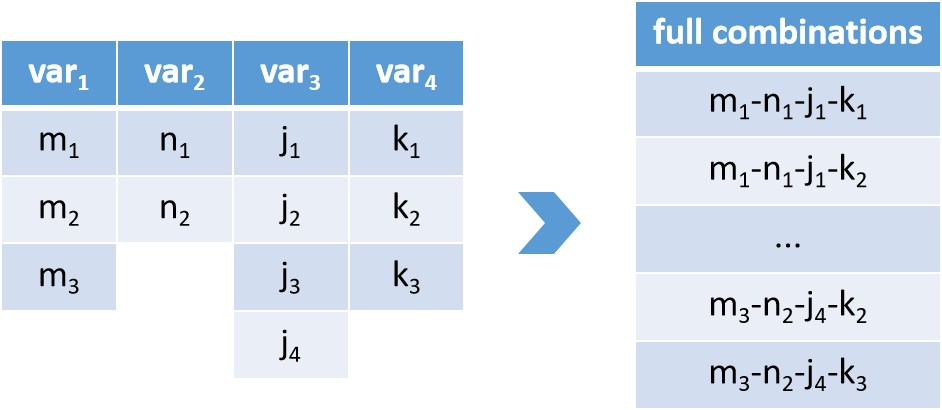
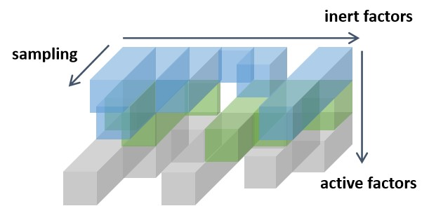
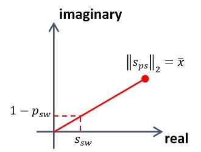

_`Factor analysis`
==================

Factor analysis is a statistical approach to quantify the variability among some observable conditions, discover
and decipher the underlying variables called *factors*. Factor analysis has developed a number of forms, for
specific implementation in practice :ref:`[Norris2010, <[Norris2010]>` :ref:`Kline2023] <[Kline2023]>`. It can also
serve as analysis system for lots of fields such as formal concept analysis (:ref:`FCA <FCA>`,
:ref:`Lutzeier1981 <[Lutzeier1981]>`), and design of experiments (:ref:`DOE <DOE>`, :ref:`[Fisher1936, <[Fisher1936]>`
:ref:`Fisher1992, <[Fisher1992]>` :ref:`Montgomery2017] <[Montgomery2017]>`).

_`Factor and level`
-------------------

.. index:: single: factor
           single: level

In factor analysis context, the term *factor* can be simply interpreted as the name of variable, then *level* is the
number of all optional values for a certain factor. For example, gender is a factor with 2 levels (male and female).
For factors with continuous values (e.g. height, weight, age etc.), :ref:`partitioning <partitioning>` is a
conventional method to build their levels.

.. note::

   The set _`partitioning` in mathematics refers for a group of :math:`n` subsets :math:`P_i,\ i \in \{1, \dots, n\}`
   for a certain non-empty set :math:`A` which satisfy:

   1. :math:`P_i \neq \varnothing,\ \forall\ i \in \{1, \dots, n\}`
   2. :math:`P_i \cap P_j = \varnothing,\ \forall\ i,j \in \{1, \dots, n\},\ i \neq j`
   3. :math:`\bigcup_{i=0}^n P_i = A`

_`Factorize indexing`
---------------------

Based on the previous concept, any of the observable variables, either continuous or discrete, can be interpreted as
factors. In practice, the variable in specific analysis can be the experimental conditions, the preprocessing options,
the modeling parameters, or the label of data. The :numref:`Figure %s <factors and levels>` gives an example for
4 factors' analysis, with 3, 2, 4, and 3 levels respectively. Its full combinations for all levels for their
corresponding factor, will include :math:`\prod_{i=1}^4 s_i` items (:math:`s_i \in s = \{3, 2, 4, 3\}`), whose form
is often utilized as indexing, or row name in the :ref:`design matrix <Design matrix>` customarily.

   factors, levels and their full combinations

Nevertheless, it should be remembered that it is so tough for experiment that traverse all possible combinations
(full factorial design) with the increasing number of factors in practice. From a certain dataset with indexing, it
is not difficult to construct how many factors and corresponding levels it has, but not all possible combinations
have been implemented, on the other hand.

_`Rearranged pseudo-tensor`
---------------------------

.. index:: rearranged pseudo-tensor

Up to now, we consider all factors equally. However, the factors are mostly mix of the dependent and independent
variables, or that of the experimental conditions and labels. They are intrinsically of different attributes.
Sometimes, we might desire the model trained from our data set that can be distinguishable for some factors,
simultaneously vary less for the others.

To fulfill that attributes of factors, a data structure called rearranged pseudo-tensor is introduced hereby
(see :numref:`Figure %s <pseudo-tensor>`). In analogy with the concept of in chemistry, it attributes factors with
active/inert type. For active type, full combinations of levels of that factors are arranged vertically. Similarly,
inert ones are horizontally arranged. For each specific combinations of inert multiplied active factors, if there
exists repeats, those data will be stacked in the 3rd dimension, namely the *sampling* axis, then forms
different columns as showed in :numref:`Figure %s <pseudo-tensor>` (empty column for no data in that combination
of levels of factors).

Thus, maybe based on some priori things, we can artificially reorganize the data as this form for further
investigation. Therefore for a certain design matrix with factorisable indexes, each column in it can be folded
as the form of that pseudo-tensor. By applying statistical approach-designed
:ref:`aggregation function <aggregation function>` (see the next subsection :ref:`Priori scoring <Priori scoring>`),
it is handy to measure then score how well that dimension matches the hypothesis.

.. note::

   An _`aggregation function` is a type of mapping from any set of numeric to scalar. The *set* of numeric can
   be a series, a vector, a tensor, or a customized structure such as the pseudo-tensor proposed in this section
   (e.g. mean, standard deviation, or etc.).

   pseudo-tensor rearranged by respectively inert and active factors

Note that the prefix *pseudo* is due to that the length of dimension for sampling is not fixed in most cases
(compared to conventional tensor with fixed lengths for respective dimensions). Moreover, with the increase of
number of combinations among factors to be investigated, more columns in that tensor are tempt to be empty.
Thus, the properties of *unfixed-dimension*, as well as *sparsity* of that data construction should be taken into
consideration when we customize the :ref:`aggregation function <aggregation function>` for scoring it.

_`Priori scoring`
-----------------

.. index:: priori scoring

For quantification for what extent the data in certain dimension matches our priori, here devises an algorithm
called **priori scoring**. Priori scoring is the default aggregation function to calculate the rearranged
pseudo-tensor to a scalar. It mainly consists of two statistical components:

_`Normality statistic`
~~~~~~~~~~~~~~~~~~~~~~

For each column in the pseudo-tensor, its levels for all factors are of the same. Namely the data in the same
column are sampled under the identical conditions. According to central-limit theorem, it guarantees the data
within certain column will converge into normal distribution with probability. Causally the objective of the
current statistic must be capable to summarize: a) basic location for numeric; b) the extent for the data biased
from a normal distribution.

Priori scoring utilizes :ref:`Shapiro-Wilk test <Shapiro-Wilk test>` to measure the normality, as showed in
:numref:`Figure %s <statistic1_priori_scoring>`. As from Shapiro-Wilk test, its statistic :math:`s_{sw}` and
:math:`p`-value (:math:`p_{sw}`) both vary from 0 to 1, the normality statistic of priori scoring :math:`s_{ps}` takes
the complex number space. For the data in a certain column, the Euclidean norm of :math:`s_{ps}` is sample mean
:math:`\bar{x}`; the direction of :math:`s_{ps}` is determined by :math:`s_{sw}` and :math:`1-p_{sw}`.

   normality statistic of priori scoring

This design naturally satisfies aforementioned two requirements. For the data set with 0 variation (all equal),
the :math:`s_{sw}` and :math:`p_{sw}` will simultaneously be 1. So it is absolutely reliable for the :math:`\bar{x}`
since the real component of :math:`s_{ps}` is equal to :math:`\bar{x}`. As the data varies largely but with the
same :math:`\bar{x}`, the :math:`s_{sw}` vary not too much (comparatively high value) but :math:`p_{sw}` will
decrease. Under this circumstance, the real component of :math:`s_{ps}` decrease correspondingly. If the data
barely distributed as normality, then the :math:`p_{sw}` will be considerably low. Therefore as the increase of
imaginary component of :math:`s_{ps}`, the projection of :math:`s_{ps}` in real axis will decrease further.

_`Variation statistic`
~~~~~~~~~~~~~~~~~~~~~~

For a certain rearranged pseudo-tensor consisted of multiple columns, applying aforementioned normality statistics
can result in a complex matrix, likely with empty values. For simplification, we attribute the term *group*, for the
combinations of levels among active factors.

Previous discussion reveals the real component of normality statistic is an effective indicator for summarizing
the value as well as the distribution of the data under the identical conditions. Consider the pseudo-tensor: for
each group, their combinations of levels among inert factors (horizontal arrangement) are of the same. Namely
statistics within all groups vary almost equally in the sight of inert factors, which satisfies homoscedasticity
of :ref:`ANOVA <ANOVA>` test.

Suppose :math:`\boldsymbol{S} \in \mathbb{C}^{d_1 \times d_2}` is the complex matrix obtained from pseudo-tensor
after normality statistics. :math:`\boldsymbol{S}^\ast` is the conjugate of :math:`\boldsymbol{S}`. Its projection
on real axis :math:`\boldsymbol{P} \in \mathbb{R}^{d_1 \times d_2}` can be calculated as:

.. math::
   :label: complex real projection

   \boldsymbol{P} = \frac{1}{2} (\boldsymbol{S}+\boldsymbol{S}^\ast)

After dealing with the empty values (usually omitting), the variation of :math:`\boldsymbol{P}` among and within
groups is implemented via :ref:`one-way ANOVA <one-way ANOVA test>`. Assume :math:`p_{ow}` denotes the
:math:`p`-value of one-way ANOVA for some case, its final score :math:`e_{ps}` evaluated by priori scoring
algorithm is determined through the negative logarithmic space as:

.. math::
   :label: score level of priori scoring

   {e}_{ps} = -\text{log}({p}_{ow})

Therefore the higher the score of variation statistic, the higher tendency of variation among groups over that of
within group ones, as well as the higher in probability that case matches the active/inert factors hypothesis.

_`Framework of algorithm`
~~~~~~~~~~~~~~~~~~~~~~~~~

If we use :math:`\mathrm{T}^+` to denote the rearranged pseudo-tensor. Consider a data set denoted as a design
matrix :math:`\boldsymbol{D} \in \mathbb{R}^{n \times m}`. :math:`\boldsymbol{c}` is the constructor consists of
factors and corresponding levels for its all factorisable indexing. If :math:`k` factors is assigned as
:math:`\mathrm{F} = \{\boldsymbol{k}_1, \dots, \boldsymbol{k}_x\}`, a partitioning
:math:`\{\mathrm{P}, \mathrm{P}^\prime\}` for :math:`\mathrm{F}` where :math:`\mathrm{P}` is the
set of active factors, and :math:`\mathrm{P}^\prime` is the inert ones, is also required before calculation.

With :math:`\boldsymbol{D}`, :math:`\boldsymbol{c}` and :math:`\{\mathrm{P}, \mathrm{P}^\prime\}`, the priori
scoring algorithm can be summarized as the :numref:`Table %s <priori scoring algorithm>`:

.. list-table:: framework of priori scoring algorithm
   :name: priori scoring algorithm
   :header-rows: 1
   :align: center

   * - priori scoring algorithm
   * - Requires: :math:`\boldsymbol{D}`, :math:`\boldsymbol{c}`, :math:`\mathrm{P}` or :math:`\mathrm{P}^\prime`
   * - Export: evaluated scores :math:`\{e_1, e_2, \dots, e_m\}`
   * - for i in :math:`\{1, 2, \dots, m\}`:

          fold :math:`D_{:, i}` to :math:`\mathrm{T}_{i}^+` via :math:`f_1(D_{:, i}, \boldsymbol{c}, \mathrm{P})`

          calculate :math:`\boldsymbol{S}_{i}` and :math:`\boldsymbol{S}_{i}^\ast` through normality statistic
          :math:`f_2(\mathrm{T}_{i}^+)`

          obtain real projection matrix :math:`\mathrm{P}_{i}` from
          :math:`0.5(\boldsymbol{S}_{i}+\boldsymbol{S}_{i}^\ast)`

          from variation statistic :math:`f_3(\mathrm{P}_i)` calculate :math:`p`-value :math:`p_{i}`, with
          logarithmic space obtain its final score :math:`e_i`

       return :math:`\{e_1, e_2, \dots, e_m\}`

After which the evaluated scores :math:`\boldsymbol{e} \in \mathbb{R}^{+m}` for
:math:`\boldsymbol{D} \in \mathbb{R}^{n \times m}` will be calculated. The significance ranking levels for all of
those dimensions in priori scoring are determined using intervals with length of 10, from 0 to ceil of
:math:`10 \cdot f_{\mathrm{ceil}} (0.1 \cdot e_{\mathrm{max}})`.

----

:Authors: Chen Zhang
:Version: 0.0.5
:|create|: May 24, 2023