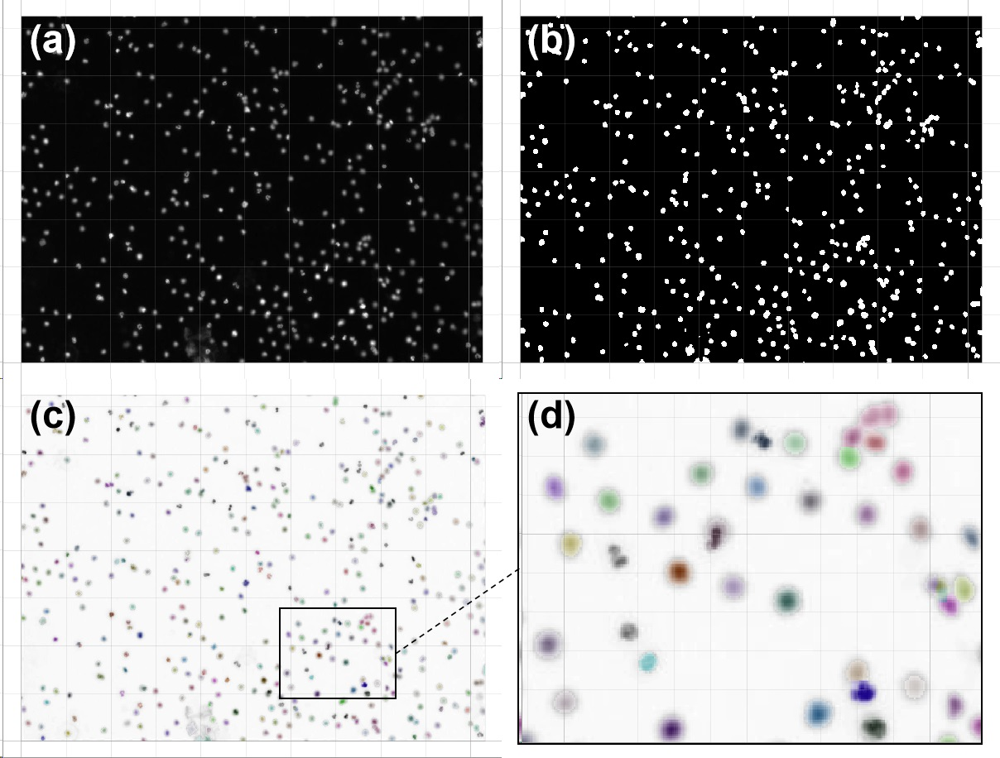
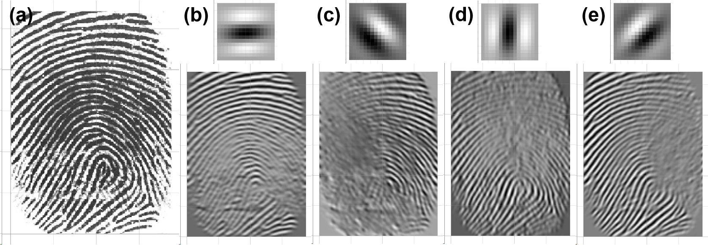
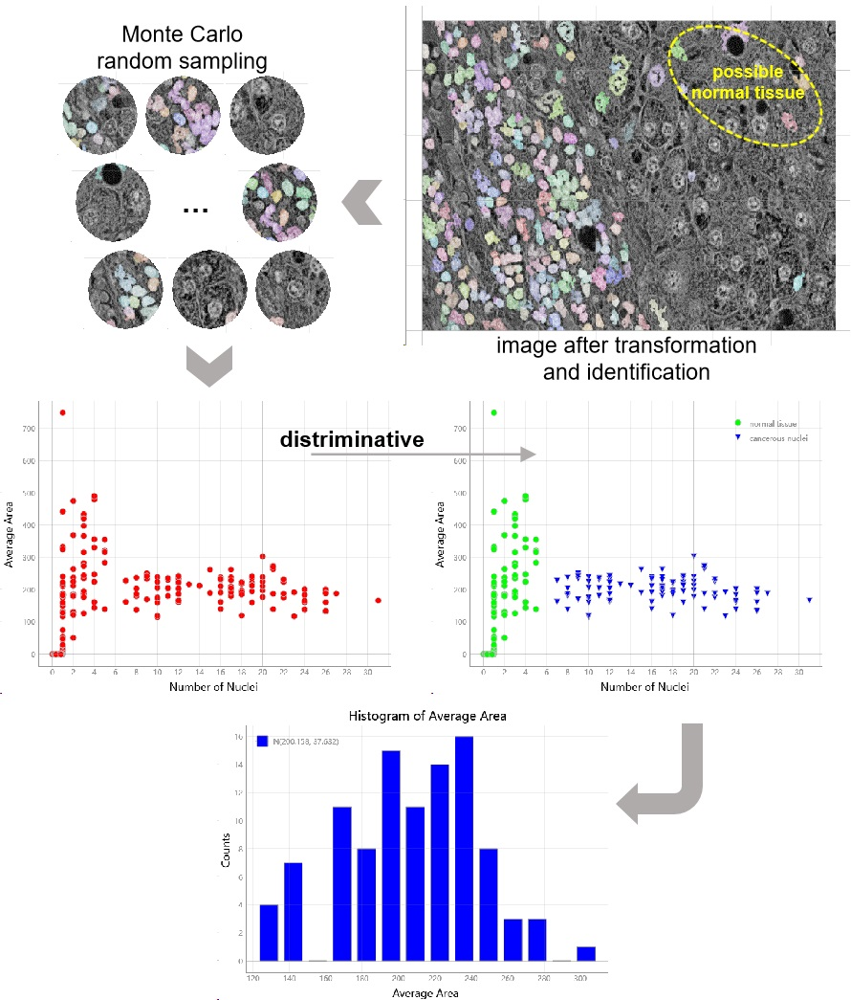

_`Data augmentation technique`
==============================

Data augmentation is a technique used in machine learning to artificially increase the size of training datasets.
It creates new data points by applying transformations to existing samples, introducing variations that mimic the
natural uncertainty found in the data. This helps to improve the model's generalization and robustness, making it
more resilient to noise and variations in real-world scenarios.

:ref:`Transformation <Data transform and identification>` is favourable as it can determine the performance upper
bound of subsequent model. According to description about :ref:`feature definition <How we define features>`, a
practical type of transformation is able to change original data to its minimal representation of information that
contributes to objective-task. Data after augmentation of transformation would be of high :ref:`SNR <SNR>`, then high
interpretability and generalization of trained model can be expected.

The generalization ability of the model is crucial for its performance in real-world applications. The better the
generalization ability of the model, the more robust and reliable it will be in practical applications. Introducing
randomness is common approach to increase the generalization, in not only model frames (e.g. random forest in ensemble
learning, random batch computing and node masking of dropout in :ref:`ANN <ANN>`), but also the data self (random sub
sampling, zoom-in, rotation etc.).

_`Determine appropriate transformation`
---------------------------------------

Valid transformation plays as key nodes in the processing flow for auto modeling or prediction. For example,
automation for thinprep cytologic test (TCT) requires labeling and measuring cells in morphology or structure,
for further diagnosis or investigation. (a) in :numref:`Figure %s <immunofluorescence image augmentation>` is an
immunofluorescence nuclei image. Automation labeling task is as similar as determining nuclei of hepatocellular
carcinoma in :numref:`Figure %s <pathological image statistics>`. Reuse that pipeline with arguments fine-tuned for
immunofluorescence image:

   augmentation for locating nuclei in immunofluorescence image

Nucleus labeling can be generally fulfilled, even though overlapped nuclei appear in observation scope.

Another illustrate case is augmentation for fingerprint recognition via
:ref:`gabor filter <spatial filtering applied on image processing>`. Four kernels with identical
:ref:`spatial sine function <spatial sine function>` along different orientations, and corresponding augmented
images are listed from (b) to (e) in :numref:`Figure %s <gabor fingerprint augmentation>`.

   fingerprint augmentation using gabor filter

Texture in different direction has been enhanced.  Those result contribute to extract the pattern of fingerprint for
further recognition. Test data is sourced from Bazen (in section :ref:`Traditional Minutiae Extraction <[Bazen2002]>`).

_`Random observer on data`
--------------------------

:ref:`Monte Carlo method <Monte Carlo method>` is a numerical technique used to solve complex problems that can
hardly be solved analytically. One of its merits is to estimate the expected value of a function or to find the
solution to a problem, relying on repeated random sampling.

Reconsider the analysis after :ref:`pathological image transformation <pathological image statistics>`: it make
statistics on distribution for equivalent area of identified nuclei, as shown in
:numref:`Figure %s (d) <pathological image statistics>`, however, the transformation cannot be absolutely adaptive
in any cases. For example, some reasons such like failure separation cases for overlapped nuclei, or nuclei in
possible normal liver tissue are labeled as well (circled within :numref:`Figure %s <mc on pathological image>`),
can possibly result in the fat tail of distribution or even outliers appears.

If a model which is specialized in more accurate estimation for that statistic (average area of nuclei in cancerous
cells) with high generalization is desired, building mass of observations via Monte Carlo is in favor. For each
random observation, it calculates the number of labeled nuclei, and their average areas within the scope. Samples
with cancerous nuclei aggregation unveils its more distinctive pattern, on basis of the corresponding scatter plot
for those two statistics on Monte Carlo sampling.

Extract those samples can be helpful for further statistical modeling in precision. For instance, the profile of
histogram for average nucleus area of cancer cell, is of neither fat tail nor appearance of outliers. Therefore
the approximate estimation for its standard deviation (37.632), should be more reliable in comparison with the one
in :numref:`Figure %s (d) <pathological image statistics>`. Or be more rigorous and comprehensive, compute for its
multivariate gaussian distribution analytically.

   Monte Carlo sampling and statistical modeling on pathological image

As all processing steps above are of physically and statistically interpretable, the obtained model can be expected
to be of both high interpretability and high generalization. Moreover, Monte Carlo method can also contribute to
increase precision of prediction: mass of random observations can be built in the same manner in area to be predicted
as well, through which some atypical signals that have impact on final outcome can be suppressed in probability.

----

:Authors: Chen Zhang
:Version: 0.0.5
:|create|: Feb 22, 2024