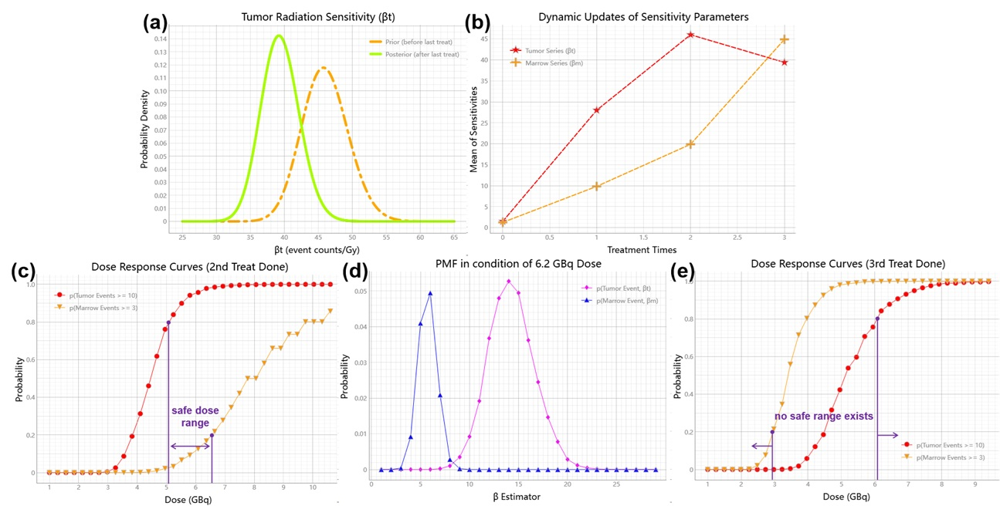

_`Adaptive AI with online learning`
===================================

The architectural analysis of edge intelligence systems across domains mentioned in
:ref:`previous tutorial <Streaming data, edge computing and online learning>`, from life-saving surgical
robotics to ambient-aware smart homes, reveals a fundamental truth: true device autonomy hinges on an
algorithm's capacity for perpetual contextual adaptation. As established in our prior examination of streaming
data ecosystems, edge devices operate in inherently nonstationary environments where sensor patterns, user
behaviors, and operational constraints evolve continuously. This dynamism renders conventional static models
obsolete, demanding instead AI systems that implement *sustained environmental symbiosis* through online
learning mechanisms.

The critical differentiator lies not in hardware specifications, but in a model's architectural capacity to
organically assimilate streaming data. Successful edge intelligence implementations share a common DNA: machine
learning architectures that treat data ingestion as a continuous calibration process rather than discrete
training episodes.

_`Redefining intelligence via adaptive models`
----------------------------------------------

_`Breaking the infinite modeling cycle`
~~~~~~~~~~~~~~~~~~~~~~~~~~~~~~~~~~~~~~~

While the term *model* remains ubiquitous in AI practice, practitioners often find themselves trapped in an
infinite loop of model-design → deployment → concept drift → re-modeling. This Sisyphean cycle stems from
treating models as fixed-parameter predictors frozen in temporal specificity. In edge intelligence contexts,
successful implementations redefine models as *continuously evolving entities* - dynamic systems that
self-calibrate through perpetual interaction with their operational environments.

_`Mathematical metaphors for adaptive systems`
~~~~~~~~~~~~~~~~~~~~~~~~~~~~~~~~~~~~~~~~~~~~~~

Effective edge AI mirrors how mathematicians distinguish between function families (e.g., quadratic functions)
and specific implementations (e.g., y=2x²+3). Consider economic policymaking: while applying Shanghai's
income benchmarks to rural Gansu would fail, the underlying methodology of per-capita analysis remains sound.
This reveals the core paradigm the edge AI implementations require:

- **Meta-architectures** providing methodological frameworks

- **Contextual instantiation** through localized data streams

- **Bayesian adaptability** enabling probabilistic adjustments

This approach transforms models from static equations into *smart containers* that maintain core analytical
principles, dynamically adjust parameters like regulatory policies adapting to regional economies, and preserve
computational efficiency through selective updates.

_`Self evolving meta models and demonstrations`
-----------------------------------------------

_`Home blood pressure monitor`
~~~~~~~~~~~~~~~~~~~~~~~~~~~~~~

Here we contextualize the :numref:`generic latency-sensitive pipe` on an edged blood pressure tracking system.
The following implementation embodies the core principles of edge AI adaptability through a Bayesian meta-container
architecture designed for multi-parameter health monitoring. This self-evolving system demonstrates how medical
diagnostic devices can maintain operational relevance amidst gradual physiological shifts.

.. code-block:: python
   :caption: dynamic bayesian blood pressure tracking system
   :name: dynamic bayesian blood pressure tracking system
   :emphasize-lines: 9

   from info.me import bayes as bys
   from scipy import stats as st
   from queue import Queue
   import numpy as np

   avg_dbp, avg_sbp, avg_pr = 73, 109, 87
   avg_mean = np.array([avg_dbp, avg_sbp, avg_pr])
   init_dis = st.multivariate_normal(avg_mean, np.eye(len(avg_mean)))
   meta, container = bys.gaussian(kernel=init_dis), Queue()
   shift_dis = st.multivariate_normal(avg_mean + np.array([-5, 4, 5]), np.eye(len(avg_mean)))  # data shift simulator
   _ = [container.put(shift_dis.rvs(30)) for _ in range(10)]

   while not container.empty():
       meta.update_posterior(posterior=container.get())

   print(meta.conjugate.mean)
   # [ 67.81901927 112.61276238  91.71077485], may vary

In the :numref:`dynamic bayesian blood pressure tracking system` we assumed the independence hypothesis among variable
:code:`avg_dbp`, :code:`avg_sbp`, and :code:`avg_pr` for simplification; If any canonical knowledge is accessible
(e.g., :ref:`WHO <WHO>` standards), their correlation, as prior knowledge, can also be embedded inside when a Bayesian
container is initialized (the highlighted line in :numref:`dynamic bayesian blood pressure tracking system`).

_`Individualized treatment program`
~~~~~~~~~~~~~~~~~~~~~~~~~~~~~~~~~~~

Edge intelligence demonstrates universal applicability in personalized treatment regimens either. The
:numref:`pharmacokinetic model for precision radiotherapy` illustrates how Bayesian solvers enable dynamic tracking
and evaluation throughout radiation therapy. While static models trained on big data may establish general priors
like the :code:`generic_prior`, clinical implementation must address individual variations in patients' responses to
radiation doses. This case study implements a Bayesian pharmacokinetic framework that initializes with generic
physiological priors, then continuously adapts through dynamic updates based on real-time biomarkers. The critical
challenge lies in precisely quantifying these inter-patient variations and optimizing phased treatment plans
accordingly. By assimilating observed therapeutic responses, including tumor regression rates and marrow toxicity
events, the system transforms fixed protocols into adaptive therapeutic trajectories, exemplifying contextual
symbiosis between AI and clinical workflows.

.. code-block:: python
   :caption: pharmacokinetic model for precision radiotherapy
   :name: pharmacokinetic model for precision radiotherapy

   from scipy import stats as st
   from info.me import bayes as bys

   generic_prior = {'k_tumor': 0.05, 'k_marrow': 0.02,
                    'beta_t': st.gamma(2.00, 2.00), 'beta_m': st.gamma(1.50, 3.33)}
   bys_tumor = bys.poisson(kernel=st.poisson(1.0), prior=generic_prior['beta_t'])
   bys_toxicity = bys.poisson(kernel=st.poisson(1.0), prior=generic_prior['beta_m'])
   beta_est = (lambda obs, dose, eff: round(obs / (dose * eff)))
   patient = [(3.7, 15, 2), (5.0, 25, 5), (6.2, 4, 18), ]  # 3 times radiotherapy, [dose, tumor_kill, marrow_kill]

   for dose_gbq, tumor_event, tox_event in patient:
       bys_tumor.update_posterior(posterior=np.array([beta_est(tumor_event, dose_gbq, generic_prior['k_tumor']), ]))
       bys_toxicity.update_posterior(posterior=np.array([beta_est(tox_event, dose_gbq, generic_prior['k_marrow']), ]))
       ...  # visualization code for updated distributions here

The implementation of the pharmacokinetic framework above reveals critical dynamics through the
:numref:`visualization for Bayesian precision radiotherapy`.
:numref:`Figure %s (a) <visualization for Bayesian precision radiotherapy>` demonstrates leftward shifting of
:math:`\beta_t` posterior distribution after the final update, indicating increased tumor radiation resistance.
Tracking initial priors and post-treatment sensitivities in
:numref:`Figure %s (b) <visualization for Bayesian precision radiotherapy>` reveals concurrent elevation of marrow
tissue vulnerability as tumor sensitivity declines. Following the second treatment, Bayesian predictive distributions
for varying dose levels (:numref:`Figure %s (c) <visualization for Bayesian precision radiotherapy>`) suggest a safe
therapeutic window of 5.05-6.50 GBq when constrained by clinical thresholds (≥10 tumor kill events with ≤3 marrow
toxicity events). Selecting 6.20 GBq enables probabilistic projections of therapeutic outcomes through dose-specific
PMF visualizations (:numref:`Figure %s (d) <visualization for Bayesian precision radiotherapy>`). Subsequent posterior
updates after phase advancement (:numref:`Figure %s (e) <visualization for Bayesian precision radiotherapy>`) expose
diminishing returns: the overlapping region satisfying clinical constraints virtually disappears, suggesting limited
therapeutic benefit from continued radiotherapy. This adaptive quantification prompts consideration of alternative
treatment modalities.

   Bayesian precision radiotherapy

The dynamic nature of adaptive AI introduces real-time evaluation mechanisms during treatment, providing critical
references for clinical decision-making. In this case, repeated therapies led to significant shifts in tumor and
marrow responses to radiation, challenging the safety and efficacy of conventional radiotherapy. This necessitates
a more cautious reassessment of therapeutic trade-offs.

_`Personalized adaptive image segmentation`
~~~~~~~~~~~~~~~~~~~~~~~~~~~~~~~~~~~~~~~~~~~

Edge medical imaging requires models to self-evolve with anatomical drift. Static segmentation architectures fail to
track time-dependent tissue variability across patients. Meta U-Net implementations achieve *embedded evolution*
through dynamic filter calibration continuously adjusting convolutional components using on-device imaging streams.
This enables medical segmentation pipelines to maintain precision as organ morphology shifts, exemplifying edge
intelligence's core principle: models as living systems, not frozen artifacts. The
:numref:`self adaption U-Net for image segmentation` concretes the edge meta AI architecture
:numref:`dynamic priority scheduling` in medical segmentation model training for patient personalization.

.. code-block:: python
   :caption: self adaption U-Net for image segmentation
   :name: self adaption U-Net for image segmentation

   from info.net import unet
   import os

   patient_imgs, patient_segs = ..., ...  # list[img_or_seg_path], pairwise
   model = unet(mirror_channels=[8, 16, 32], in_dimension=3) if not os.path.exists(_m := 'patient_seg') else load(_m)
   while True:

       ...  # some AI-assistant application here

       if device.in_idle():
           with model.infer_session() as md:
               dice = md.score(train=(img_loader(_) for _ in patient_imgs),
                               target=(img_loader(_) for _ in patient_segs))
           if dice > thre:
               with model.train_session() as md:
                   md.solve(train=(img_loader(_) for _ in patient_imgs),
                            target=(img_loader(_) for _ in patient_segs),
                            stop_conditions={'loss': thre})

This self-adaptive architecture demonstrates how edge-native online learning mechanisms transform static models into
computational organisms. By selectively activating parameter updates during device idle cycles, the system achieves
two symbiotic objectives: (1) real-time adaptation to anatomical shifts through dynamic filter recalibration, while
(2) preserving computational resources via threshold-controlled training triggers. The :code:`dice > thre` condition
embodies edge intelligence's essential trade-off: evolving only when environmental changes threaten operational
validity. Such implementations prove that medical AI need not choose between generalization and personalization when
models architecturally embrace perpetual metamorphosis.

----

:Authors: Chen Zhang
:Version: 0.0.6
:|create|: May 10, 2025