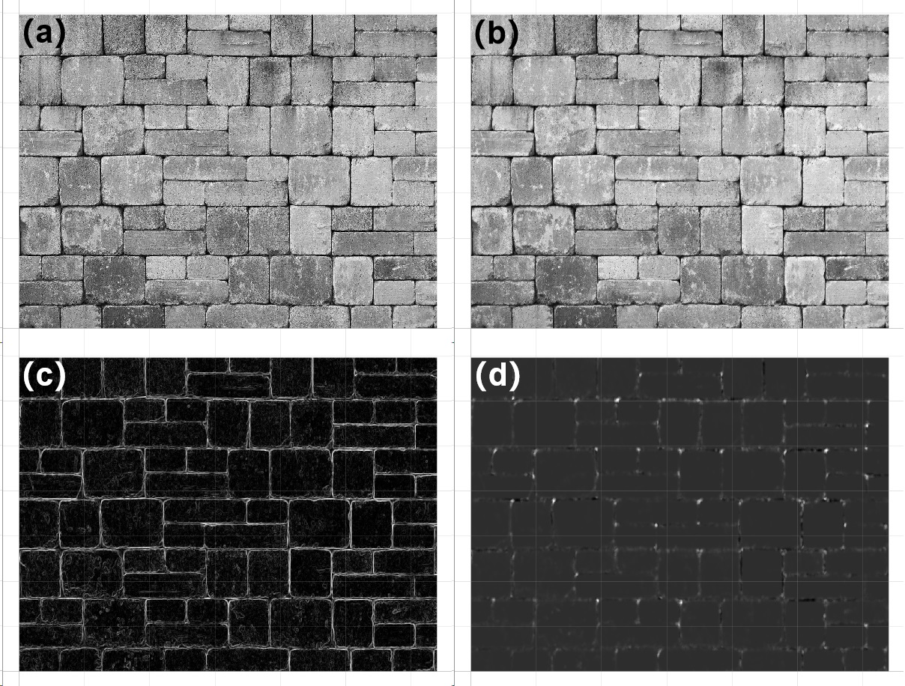
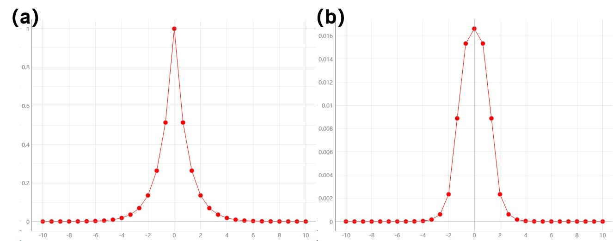
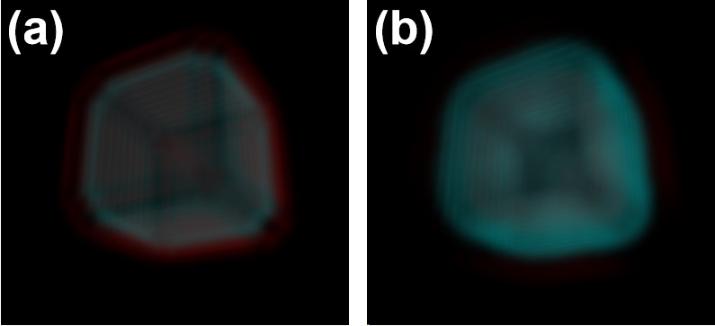
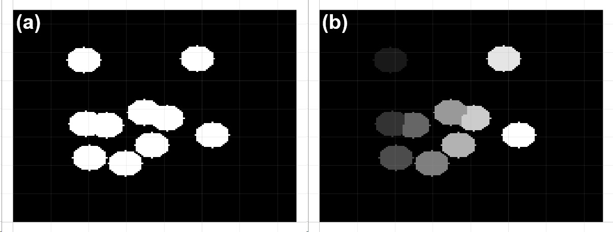
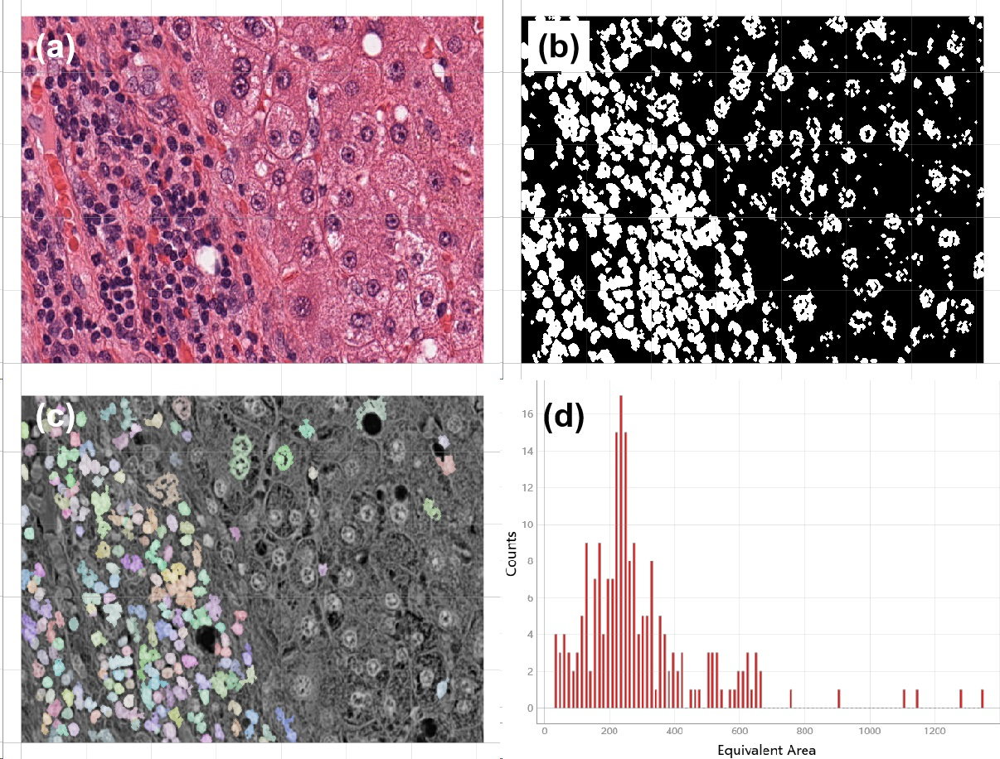
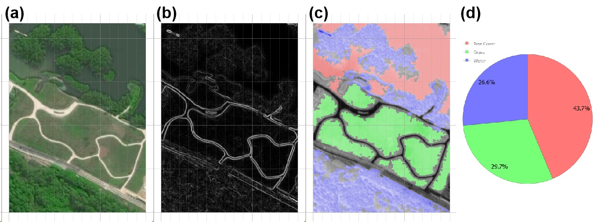

_`Data transform and identification`
====================================

In data analytics, machine learning, or deep learning, approaches to build proper pipes of pre and post
processing, are critical steps for determining the ceiling of model performance. Data defined here mainly refers
to :math:`n`-dimensional array in computer science (or tensor in mathematics). This tutorial demonstrates image
enhancement methods generally applied in computer vision, as well as their upper applications in certain study
fields.

_`Edge and corner detection`
----------------------------

General filters can be applied on tensor for profile detection, keypoint identification for registration, and
such like. :numref:`Figure %s <transform of edge and corner detection>` reveal the effect of (b) the bilateral
filter, (c) the canny filter and (d) the harris response, applied on (a) a original natural image, respectively.
The edge of objects, as well as corner-like region can be emphasised through those data processing methods.

Different transformations might contribute for varying objectives: de-noising processing possibly prefers the
bilateral filtered result; to evaluate degree of interspace of bricks, canny response would be helpful.

   bilateral filter, edge and corner response

Additionally, those processing transforms can also be called, in consistence with data with different dimension(s).
:numref:`Figure %s <harris response 1D>` shows harris response for high curvature, on 1-dimensional series,
and :numref:`Figure %s <canny filter 3D>` is canny filter applied on a 3-dimensional cubic instance.

   harris response on 1D series

   canny filter on 3D volume

:numref:`natural image processing` is for referenced implementation, as well as visualization for those examples.

.. code-block:: python
   :caption: natural image processing
   :name: natural image processing

   from info.me import tensorn as tsn
   from info.vis import visualization as vis
   from info.vis import ImageViewer
   from info.ins import datasets
   import numpy as np

   img = datasets.bricks()
   imgs = [img, tsn.bilateral_filter(data=img, k_shape=(5, 5)),
           tsn.canny_filter(data=img), tsn.harris_response(data=img, k_shape=(10, 10))]
   for f in imgs:
       vis.Canvas.play(data=f, fig_type='image')

   f1 = (lambda s: np.min(np.array([np.e ** s, np.e ** (-s)]), axis=0))
   x = np.linspace(-10, 10, 31)
   y = f1(x)
   y1 = tsn.harris_response(data=y, k_shape=(4,))
   vis.Canvas.play(data=(x, y))
   vis.Canvas.play(data=(x, y1))

   def cubic(r, c, shape=(50, 50, 40)):
       res = np.zeros(shape)
       for idx in np.argwhere(res == 0):
           if (r1 := np.linalg.norm(idx-c, ord=4)) < r:
               res[tuple(idx)] = r1
       return res * 50

   s1 = cubic(7, np.array([25, 25, 20]))
   s2 = tsn.canny_filter(data=s1)
   ImageViewer.play(data=s1)
   ImageViewer.play(data=s2)

With appropriate method of transformation customized for specific task as upstream processing, information
with high analytical value remains while disturbance signal is restricted, therefore increasing upper bond on
performance of modeling, can rationally be expected.

_`Segmentation for quantitative statistics`
-------------------------------------------

Quantitative analysis takes labeling different objects from a total segmentation as the prerequisite. In practice,
some classic algorithms, or their combinations can be applied to identify each individual, then downstream
mathematical statistics, as well as corresponding analysis are capable to be undertaken.

As illustrated in :numref:`Figure %s <labeling segmentation>`, for determining each instance in condition that
overlapped area among two or more might occur, proper configuration of distance transform combined with
connected domain will precisely allocate each basin for initial flooding seed.

   labeling segmentation through topography

Demonstrated implementation is as showed in :numref:`segmentation labeling`:

.. code-block:: python
   :caption: segmentation labeling
   :name: segmentation labeling

   from info.me import tensorb as tsb
   from info.vis import visualization as vis
   from scipy.ndimage import distance_transform_edt
   import numpy as np
   np.random.seed(10)

   msk = np.zeros((150, 150)).astype(bool)
   msk[25:125, 25:125] = True
   msk = np.sum([_ for _ in tsb.prober(data=msk, prob_nums=10, prob_radius=9)], axis=0).astype(bool)
   vis.Canvas.play(data=msk, fig_type='image')
   geo, seeds = -distance_transform_edt(msk), np.zeros_like(msk).astype(bool)
   seeds[np.where(geo < -8)] = True
   seeds = np.sum([(i+1)*e for i, e in enumerate(tsb.connected_domain(data=seeds))], axis=0)

   # labeling with different integers:
   res = tsb.watershed(data=msk, flood_seeds=seeds)
   vis.Canvas.play(data=res, fig_type='image')

_`Data processing on different disciplines`
-------------------------------------------

Comprehensively utilizing those essential techniques for transform and identification, can build considerably
complicated data processing pipelines on many study fields. :numref:`Figure %s <pathological image statistics>`
is for evaluating equivalent area of tumor cell nucleus. Data is collected from a hepatocellular carcinoma case
from The Cancer Genome Atlas (`TCGA <https://www.cancer.gov/tcga>`_) program.

   statistics for nucleus of tumor cells on pathological image

Another example is for surveying and mapping engineering.  After certain preprocessing flows, road net can be
highlighted, and the envelopes for water, grass, tree cover, and the corresponding area percentages were determined
as well, as showed in :numref:`Figure %s <semantic on topography>`.

   semantic statistics on topography

In material research, measuring grain is a conventional approach to understand formation, as well as the principle
of the formation of microstructure. :numref:`Figure %s <grain measure>` demonstrates grain boundaries determination
via 2nd order differential transformation followed by labels identification, then exporting scatter plots for grain
radius and area as x- and y-axis, respectively. The test data is from a bulletin published on
`Vac Aero <https://vacaero.com/information-resources>`_.

   metallic grain measurement

----

:Authors: Chen Zhang
:Version: 0.0.5
:|create|: Jan 2, 2024
